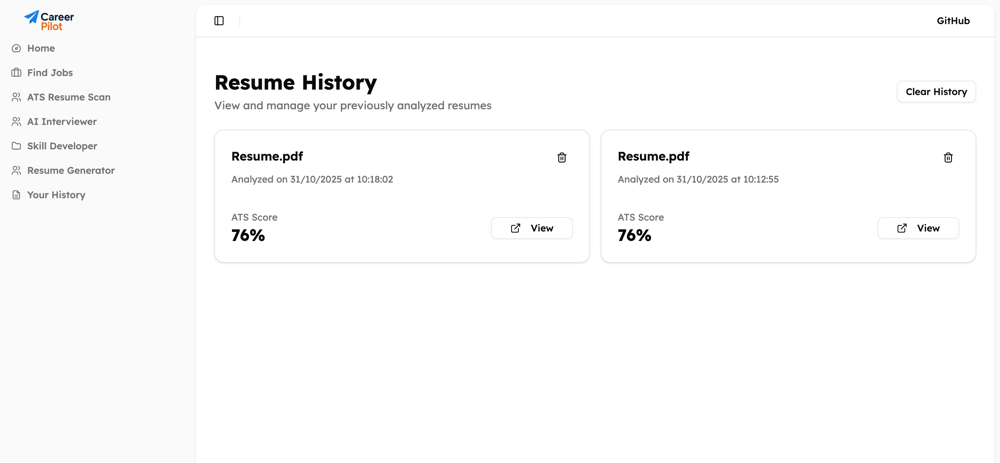
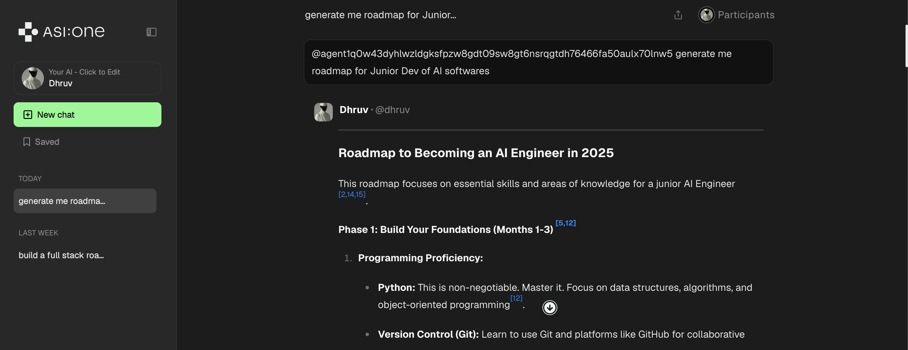
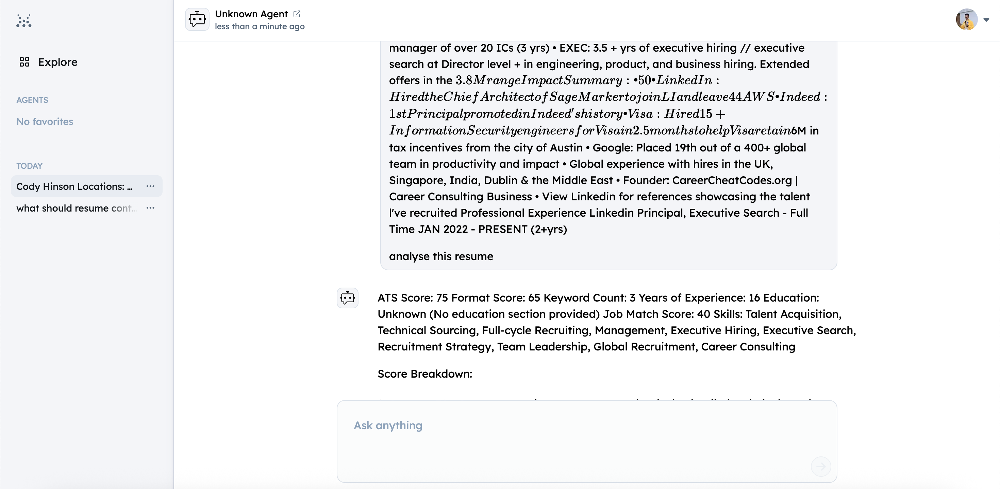

# 🎯 CareerPilot – Smart Career Companion

## 🧠 Overview

**CareerPilot** is your intelligent job-hunting companion that:
- 📄 Scans and scores resumes with ATS standards
- 🔍 Recommends jobs based on your personalized profile
- 🧠 Conducts AI-powered mock interviews
- ✨ Builds custom resumes tailored for any job
- 🎯 Guides you on skill gaps and learning paths
- 👤 Optimizes your job-seeker profile

## 🛠️ Tech Stack

| Layer       >>>>>>>>>>>?>

# 🤖 Agent Highlights (for Skill Fest)

| Agent               | Capability                            |
|----------------------|----------------------------------|
| ATSScannerAgent    | Resume evaluation and suggestions      |
| JobMatchAgent      | Personalized job recommendations       |
| MockInterviewAgent | AI-basedu u interview simulation          |
| SkillGuideAgent    | Skill improvement and learning roadmap |
| CVBuilderAgent     | Tailored resume creation               |

## 🚀 Features

### 🔍 ATS Resume Scanner
- Fetch.ai Based Agent specific to this usecase
- Highlights improvements for ATS compatibility  
  

### 🧠 Job Matching & Recommendation
- Matches your profile with trending jobs  
  

### 🗣️ AI Mock Interviews
- Role-specific AI interviews
- Custom scoring & feedback  
  

### 🧾 Resume Builder
- Builds role-specific resumes in seconds
- Auto-formats using best practices  
  

### 🧭 Skill Guidance
- Suggests learning paths based on job interest
- Maps gaps between your profile & job needs  
  

  
### History

### Agents Link:
[AI-Interviewer](https://agentverse.ai/agents/details/agent1qgw9t5umr047p5pepuugrws5lzav0s2qhgeht6hghy8r8j5a7un7uvqvmcj/profile
)
 
[Resume-Analyser](https://agentverse.ai/agents/details/agent1qtsx65dg06vkkyq0u5w0mtv7enqu6hwt5cyerx3ggnd9z5j26uhaylngre9/profile)
 
[Roadmap-Agent](https://agentverse.ai/agents/details/agent1q0w43dyhlwzldgksfpzw8gdt09sw8gt6nsrqgtdh76466fa50aulx70lnw5/profile)
 
[Resume-Generator](https://agentverse.ai/agents/details/agent1qvr9gefmhwsfg6vp7y7nqc2pecxs4r6xsrpju3w58u7a0a8cuzgxkmhtua2/profile)
### With ASI One

## Build by:
Dhruv Kumar

  
  
  

